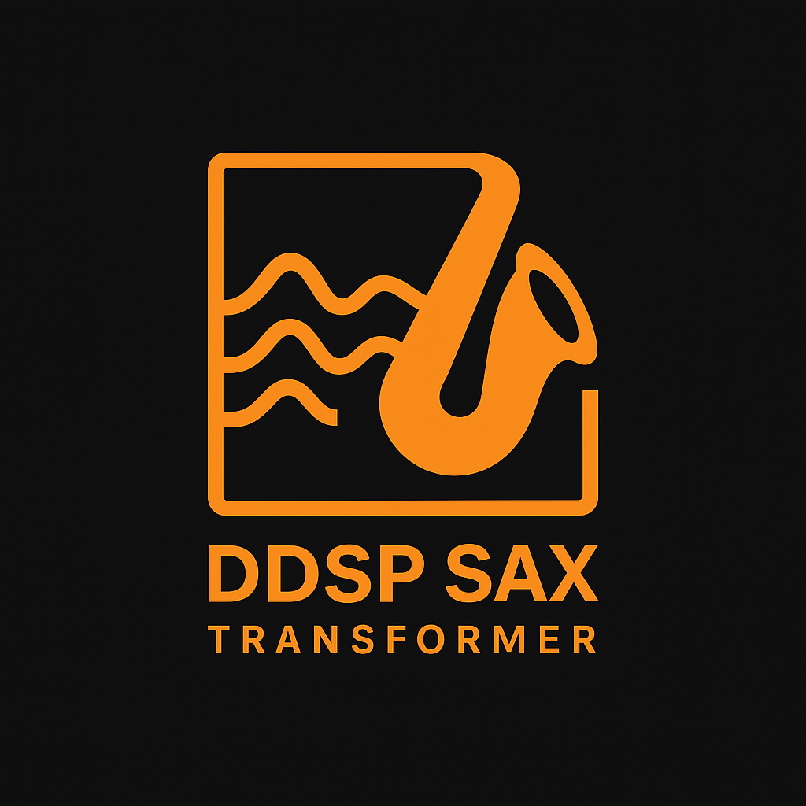

<p align="center">
  
</p>

# 🎷 DDSP Sax Transformer

This project implements a **Differentiable Digital Signal Processing (DDSP) Autoencoder** that transforms the timbre of any input sound into a **tenor saxophone**.  
The model is trained on tenor saxophone recordings and their extracted **fundamental frequency (f0)** tracks.

---

## 📂 Dataset Preparation

1. Place your audio data inside the `data/` folder.  
   - Use ~5 minute `.wav` files.  
   - Organize them into two subfolders:  
     - `train/` → for training data  
     - `valid/` → for validation or test data  

2. Extract fundamental frequency (**f0**) using [CREPE](https://github.com/marl/crepe):  

```bash
# Example: extract f0 from a directory of audio files
crepe directory-to-audio/   --output directory-to-audio/f0_0.004/   --viterbi   --step-size 4
```

3. Ensure that your dataset’s **sample rate** matches the YAML config.  
   If resampling is needed (e.g., to 16 kHz), use **FFmpeg**:  

```bash
# Example: convert to mono and resample to 16kHz
ffmpeg -y -loglevel fatal -i $input_file -ac 1 -ar 16000 $output_file
```

---

## ⚙️ Configuration

- Edit the YAML file inside the `config/` folder to match your dataset and training setup.  
- Parameters include sample rate, frame resolution, GRU units, number of harmonics, etc.

---

## 🚀 Training

From the `train/` folder, run:

```bash
cd train
python train.py
```

---

## 🎧 Testing

You can test the model during or after training:

```bash
cd train
python test.py   --input input.wav   --output output.wav   --ckpt trained_weight.pth   --config config/your-config.yaml   --wave_length 16000
```

This will output the transformed audio, where the input timbre is mapped into a **saxophone timbre**.

---

## 📦 Requirements

Install dependencies with:

```bash
pip install -r requirements.txt
```

Example `requirements.txt` (already included in this repo):

```txt
torch>=2.3.0
torchaudio>=2.3.0
numpy>=1.23.5
omegaconf>=2.3.0
ddsp>=3.6.0
crepe>=0.0.12
torchcrepe>=0.0.24
librosa>=0.11.0
scipy>=1.13.1
soundfile>=0.13.1
audioread>=3.0.1
resampy>=0.2.2
soxr>=0.5.0.post1
pretty_midi>=0.2.10
mir_eval>=0.8.2
mido>=1.3.3
onnx>=1.18.0
onnxruntime>=1.19.2
pandas>=2.2.3
scikit-learn>=1.6.1
matplotlib>=3.9.4
tqdm>=4.67.1
PyYAML>=6.0.2
```

---

## 📜 License

This project is released under the [MIT License](LICENSE).

---

## 🔗 References

- [DDSP: Differentiable Digital Signal Processing](https://magenta.tensorflow.org/ddsp) by Magenta / Google Research  
- [ddsp-pytorch](https://github.com/sweetcocoa/ddsp-pytorch) – PyTorch implementation used as the foundation for this project  
- [CREPE: A Convolutional Representation for Pitch Estimation](https://github.com/marl/crepe)  

---

## 🙌 Acknowledgement

This repository is adapted and extended for research and educational purposes.  
Special thanks to the authors of the original DDSP and ddsp-pytorch projects.
